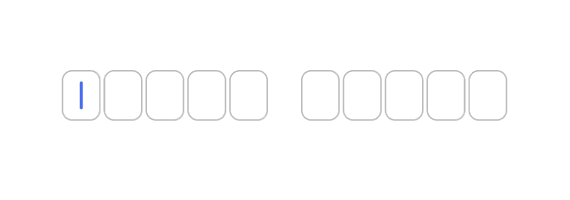

# react-native-quiz-input


## Basic Demo


## Description
`react-native-quiz-input` is a React-Native package that allows the creation of individual character text inputs. The user will simply type with the keyboard and be automatically moved to the next input or to the previous one (in case of backspace). Spaces are also supported, therefore it is suitable for Quiz-like interfaces, Credit Card inputs, OTP screens and so on.


## Installation
with Yarn:
```
yarn add react-native-quiz-input
```

or NPM:
```
npm install react-native-quiz-input
```


## Usage
Import the component in your project:
```
import QuizInput from 'react-native-quiz-input'
```
Use the component:
```typescript
<QuizInput
    wordStructure={ [ true, true, true, false, true, true, true ] }
    onChange={ action( 'onChange' ) }
/>
```

## Props

| Name             | Type                       | Description                                                                                                              | Example                                   | isRequired? |
|:-----------------|:---------------------------| :------------------------------------------------------------------------------------------------------------------------| :-----------------------------------------|:------------|
| wordStructure    | `ReadonlyArray<boolean>`   | Array representation of the words, where `true` is a letter and `false` is a space                                       | `[true, true, false, true, true, true]`   | yes         |
| onChange         | `(TCallbackData) => void`  | Callback function. It will return the input content as array and as string                                               | check types for more details              | yes         |
| maxBoxesPerLine  | `number`                   | Max input boxes per line. When set, it will automatically divide in multiple rows when needed. <br />Default: `0` (off)  | `13`                                      | no          |
| lineBreakOnSpace | `boolean`                  | Create a new row for each word.<br /> Default: `false`                                                                   | `true`                                    | no          | 
| autoFocus        | `boolean`                  | Autofocus first input when component is loaded.<br /> Default: `true`                                                    | `true`                                    | no          |
| backgroundColor  | `string`                   | Background color of each input box.<br /> Default: `transparent`                                                         | `#7FDCFF`                                 | no          |
| textColor        | `string`                   | Text color of each input box.<br /> Default: `#000`                                                                      | `#001F3F`                                 | no          |
| borderColor      | `string`                   | Border color of each input box.<br /> Default: `#BBB`                                                                    | `#DDD`                                    | no          |
| size             | `small \| medium \| large` | Size of each input.<br /> Default: `medium`                                                                              | `large`                                   | no          |

## Types
WIP

## Other examples
WIP